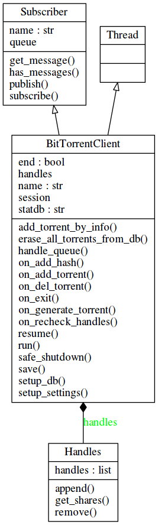

BitTorrent
==========

Als erster Teil der beschriebenen Problemstellung soll die Implementierung eines BitTorrent Clients zur Übertragung der Nutzdaten besprochen werden.

Als Anforderung an die Komponente stellt sich, dass diese über die komplette Laufzeit des Programms neben der XMPP Komponente laufen muss. Daher arbeitet der BitTorrent Client in einem eigenen Thread.

Dazu ist eine Kommunikation mit anderen Programmteilen nötig, deren genaue Implementierung im Kapitel TODO erläutert wird. Dieses Kapitel beschränkt sich auf die benötigten Schnittstellen und geht auf deren Zweck ein.

Aufbau der Komponente
---------------------

.. _fig-classes-bt:

   Klassendiagramm BitTorrent

Wie in Klassendiagramm :num:`_fig-classes-bt` zu sehen, leitet sich die BitTorrentClient Klasse  aus der Thread Klasse ab, die sich in der Python Standard Libary befindet und somit zum "Lieferumfang" jeder Python Installation gehört.

Außerdem erbt BitTorrentClient von der Klasse Subscriber, deren implementierung im Kapitel TODO erläutert wird und die Funktionen zur Prozesskommunikation bereitstellt.

Als BitTorrent Libary wurde libtorrent verwendet.
Über diese kann ein "session" Objekt erzeugt werden, über das Einstellungen wie die zu nutzenden Ports gemacht werden können, und das Hilfsfunktionen wie das Erstellen eines Torrent Objektes aus einem Magnet Link zur Verfügung stellt.

Zur Verwaltung der Torrent Handles, also der Objekte, die die jeweiligen Torrents repräsentieren, wurde außerdem die Klasse "Handles" als Wrapper um eine Liste implementiert.
Genutzt wird vom Client nur "append" und "remove" um Torrent Handles anzuhängen bzw. zu entfernen. Die get_shares Methode wird vom XMPP Client genutzt um die eigenen Handles als Liste von Dictionarys mit einigen Eckdaten auszulesen.

Erstellen des BitTorrentClient Objekts
--------------------------------------

.. code-block:: python

    def __init__(self):
        Thread.__init__(self)
        Subscriber.__init__(self, autosubscribe=True)

        [...]

Im ersten Schritt werden im Konstruktor die beiden Basisklassen, Thread und Subscriber, initalisiert.

Subscriber wird hier mit "autosubscribe=True" erstellt. Dies bedeutet, dass alle Methoden, die mit "on_" beginnen, automatisch als Topic zum Empfangen von Nachrichten registriert werden. So ist es relativ einfach möglich, aus anderen Programmteilen beispielsweise einen Torrent hinzu zu fügen oder das Beenden des Threads an zu stoßen.

Danach wird überprüft, ob eine SQLite Datenbank in Homeverzeichnis des Nutzers existiert. Der Dateiname ist festgelegt auf ".bitween.db". Ist diese Datei nicht präsent, wird sie erzeugt. Dazu wird in der Methode setup_db eine neue Tabelle "torrents" mit den Spalten "magnetlink", "torrent", "status" und "save_path" angelegt. Diese werden benötigt um die Torrents zu persistieren.

Als nächstes wird das session-Objekt erzeugt und je nach geladener Konfiguration Einstellungen gemacht: Ports auf denen BitTorrent arbeiten soll werden festgelegt (oder, wenn nicht gesetzt, dynamisch von der Libary gewählt), UPNP und NATPMP werden aktiviert wenn gewünscht. Diese Techniken werden benutzt um automatisch Ports in der NAT Table zu setzen und wird üblicherweise für den Betrieb hinter einem DSL Router benötigt.

Zu guter Letzt werden die in der SQLite Datenbank vorhandenen Torrents geladen und mit dem session Objekt verknüpft.

Danach ist der BitTorrentClient für den Start vorbereitet.

Der Run-Loop
------------

Die Aktivität eines Thread Objektes wird in der "run" Methode der Klasse definiert. Diese kann dann nach dem erzeugen des Objektes mit "start()" gestartet werden.

.. todo::

   flowchart des loops (1. teil)

In diesem Fall wird, solange Variable "end" des BitTorrentClient Objektes False ist, eine Methode "handle_queue" aufrufen, danach mit der Methode "handle_alerts" die Meldungen des session Objektes verarbeiten und danach eine Sekunde warten.

.. code-block:: python

    def handle_queue(self):
        if self.has_messages():
            topic, args, kwargs = self.get_message()
            try:
                f = getattr(self, 'on_%s' % topic)
                f(*args, **kwargs)
            except Exception as e:
                logger.error('something went wrong when calling on_%s: %s' % (topic, e))

"handle_queue" überprüft, ob Nachrichten vorliegen: die von Subscriber geerbte Methode get_message wird aufgerufen und das Ergebnis in die Variablen   "topic", "args", "kwargs" geschrieben.
Es folgt ein try-except Block, in dem versucht wird, eine Methode mit dem Namen "on_" verknüpft mit "topic" und "args" als Argumente und "kwargs" als Named Arguments aufzurufen.
Wie für Python Methoden üblich sollte args eine Liste sein, kwargs ein Dictionary.

Ein Beispiel zur Funktion:

   get_message liefert als topic den String "test", als args = [2, 4] und als kwargs = {'name': 'Peter'}. Dann wird im Try-Block eine Funktion mit Namen "on_test" gesucht und der Variable f zugewiesen. In dieser Klasse würde an dieser Stelle schon eine Exception geworfen und eine Fehlermeldung ausgegeben werden.
   Wäre die Funktion vorhanden, würde dann on_test(2, 4, name='Peter') aufgerufen werden.

So können alle Funktionen die mit "on_" beginnen "von außen" genutzt werden. Beispielsweise kann ein neuer Torrent per SHA1 Hash über die Methode on_add_hash hinzugefügt werden. In dieser würde dann ein neuer Torrent angelegt und entsprechende IP-Adressen und Ports hinzufügen, wo der Torrent zu finden ist. Dazu müssen natürlich in der XMPP Komponente die entsprechenden Informationen gesammelt worden sein.

In der handle_alert Methode wird jeweils eine Meldung der Session verarbeitet. So wird zum Beispiel bei einem "torrent_update_alert" eine Nachricht mit topic "publish_shares" erzeugt, was den XMPP Client veranlassen würde, eine Liste der aktuellen Torrents zu senden. Ein "portmap_alert" wäre zu erwarten, wenn ein Port per NAT gemapped wurde. In diesem Fall würde eine Nachricht auf topic "set_port" mit dem externen Port als Argument erzeugt.

Beenden des Run-Loops
---------------------

.. todo::

   flowchart des loops (2. teil)

Wird "on_exit()" aufgerufen, wird die "end" Variable auf True gesetzt und das "saubere" Beenden des Threads wird eingeleitet.
Als erstes werden alle Einträge aus der SQLite Datenbank entfernt, damit nur Torrents die noch Teil der Session sind, gespeichert werden können.
Dann wird für jeden Torrent das Erzeugen der "resume data" angetriggert.

Danach läuft eine Schleife, solange noch Torrent Handles vorhanden sind. Da für jeden Torrent ein "save_resume_data_alert" erwartet wird, kann im Handling dieses Alerts der Torrent in die SQLite Datenbank gespeichert und aus der Session entfernt werden.
Wird stattdessen ein "save_resume_data_failed_alert" empfangen, wird der Torrent ohne zu speichern aus der Session entfernt. Das kommt vor, wenn ein Torrent neu hinzugefügt wurde und das Programm beendet wird bevor genug Daten geladen wurden um ein "komplettes" Torrent File zu erzeugen.

Um nun eine Übersicht der eigenen Torrents zu versenden und Daten über andere Torrents zu empfangen wird die XMPP Komponente benötigt, die im folgenden Kapitel beschrieben wird.