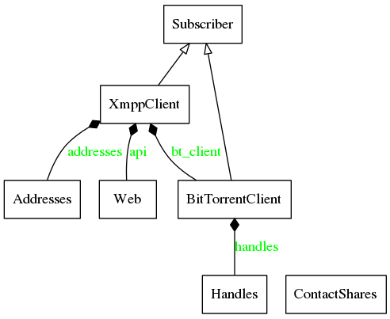

Entwurf
=======

.. _modules:

   Modulübersicht

Das Programm gliedert sich in verschiedene Kernkomponenten (:num:`modules`), die in den folgenden Kapiteln besprochen werden:

 - der XMPP Client (XmppClient)

    Der XMPP Client ist dafür zuständig eine Verbindung mit dem gewünschten XMPP Server herzustellen, bei jeder Aktualisierung der Torrents eine neue Übersicht über die angebotenen Shares an den Server zu übermitteln und Aktualisierungen aus der Kontaktliste zu empfangen.
    Darüber hinaus startet der Client alle weiteren benötigten Prozesse und dient somit als "Aufseher" über die Startreihenfolge und eventuelle Abhängigkeiten.
    Als XMPP Libary wird hier die Python Bibliothek SleekXMPP verwendet.

 - der BitTorrent Client (BitTorrentClient)

    Der BitTorrent Client lädt beim Start gespeicherte Torrents der letzten Session. Er stellt im Falle von hinzugefügten Torrents eine Verbindung zu allen IP-Adressen (und damit zu allen anderen BitTorrent Clients) her, die bisher per XMPP empfangen wurden.
    Als Libary wird libtorrent verwendet, eine in c++ geschriebene Bibliothek mit optionaler Python Anbindung.

 - eine Nutzerschnittstelle zur Bedienung (Web)

    Die JsonRPC API des Web Moduls dient als Schnittstelle für Frontends.
    Da das Programm theoretisch als Daemon auf einem entfernten Rechner laufen könnte, öffnet es einen Port zur Steuerung.
    Hier wurde mit Hilfe des Frameworks Flask ein minimales Webinterface und eine JSONRPC Schnittstelle für andere externe Anwendungen entwickelt.

 - ein Modul zur IPC (Subscriber)

    Da alle genannten Module in eigenen nebenläufigen Threads laufen wird eine Komponente zur Inter Process Communication benötigt.
    Hierzu wurde eine Publish-Subscribe Pattern implementiert, die das zuweisen der Nachrichten zu Subscribern übernimmt. Außerdem dient es als Basisklasse, von der alle Klassen, deren Objekte Nachrichten empfangen, abgeleitet werden. Dazu wurde eine einfache Scheduling Funktion Implementiert.

Außerdem Klassen zur Abstrahierung der Daten zur Laufzeit:

    - Addresses für die eigenen IP-Adressen und BitTorrent Ports
    - Handles für die einzelnen Torrent Handles
    - ContactShares für alle empfangenen Shares

