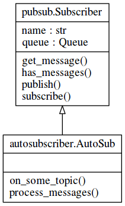

IPC
===

Die Kommunikation zwischen den Threads wurde durch eine PublishSubscribe Pattern gelöst.
Wie bei Publish-Subscribe des XMPP Protokolls können Teilnehmer (in diesem Fall Objekte der jeweiligen Klassen) Nachrichten zu bestimmten Topics abonnieren ("subscriben"). Außerdem steht eine "publish" Methode zur Verfügung, mit der Nachrichten auf bestimmten Topics veröffentlicht werden können.

Hierzu wurde eine Klasse "Subscriber" implementiert die als Basisklasse für alle anderen Klassen dient, die Nachrichten empfangen.
Jedes Subscriber-Objekt besitzt eine Queue, die alle noch unverarbeiteten Nachrichten enthält, eine subscribe-Methode um Nachrichten zu Topics zu "Abonnieren" sowie eine has_messages- und get_messages-Methode um den Zustand der Queue abzufragen und Nachrichten zu entnehmen.

Im Folgenden Diagramm ist außerdem eine Klasse "AutoSub" zu sehen, die dazu dient die PubSub Klasse zu testen, und die gleichzeitig als einfaches Beispiel dienen soll, wie eine Klasse einige ihrer Methoden direkt als Topics abonnieren kann. Hierauf wird am Ende dieses Kapitels genauer eingegangen.

Im einfachsten Fall wird ein Subscriber Objekt ohne Parameter erstellt. Dann wird nur eine Nachrichtenqueue angelegt und es können Topics mit subscribe('topicname') abonniert werden.

.. code-block:: python

    s = Subscriber()
    s.subscribe('some_topic')

Wird daraufhin die Methode publish eines Objekts der Subscriber Klasse oder die Funktion publish des pubsub-Moduls mit 'topicname' als erstem Argument aufgerufen, wird eine Nachricht im queue der entsprechenden Klasse hinterlegt.

.. _concept_pubsub:
.. figure:: resources/pubsub_concept.png
   :align: center
   :alt: Pubsub Konzept

Die Grafik :num:`concept_pubsub` soll dieses Konzept verdeutlichen. hier sind subscriber_A und subscriber_B Abonnenten des "topic_A". Wird nun publish() mit den Argumenten 'topic_A', 12, 'test' aufgerufen, wird in den Queues der beiden subscriber die Entsprechende Nachricht hinterlegt und kann im Objekt verarbeitet werden.

Dazu wird in der Methode ein Dictionary des pubsub Moduls benutzt, in dem gespeichert wird, welches Objekt welche Topics abonniert hat.

Automatisches Abonnieren von Topics
-----------------------------------

.. code-block:: python
   :linenos:

   class Subscriber:
       def __init__(self, name='', autosubscribe=False):
           [...]
           if autosubscribe:
               listen_to = [x for x, y in self.__class__.__dict__.items() if
                            (type(y) == FunctionType and x.startswith('on_'))]
               for l in listen_to:
                   self.subscribe(l.split('on_')[1])

Eine interessantere Anwendung ergibt sich, wenn eine Subklasse von Subscriber erstellt und autosubscribe mit True aufgerufen wird. In diesem Fall wird erst eine Liste mit allen Methoden erstellt, deren Name mit "on_" beginnt (Zeile 5 und 6). Dann wird über die Liste der gesammelten Namen iteriert: das "on_" am Anfang wird abgeschnitten, und der resultierende String wird als Topic abonniert.

Damit besteht die Möglichkeit, Methoden der Klassen direkt als Topics zu abonnieren und es entfällt das händische zuordnen von Topics und Funktionsaufrufen.

Als Beispiel hierzu dient die folgende Klasse AutoSub, die sich von Subscriber ableitet.

.. code-block:: python

    class AutoSub(Subscriber):
        def __init__(self):
            Subscriber.__init__(self, autosubscribe=True)

        def process_messages(self):
            if self.has_messages():
                topic, args, kwargs = self.get_message()
            try:
                f = getattr(self, 'on_%s' % topic)
                f(*args, **kwargs)

            except Exception as e:
                logger.error('something went wrong when calling on_%s: %s' % (topic, e))

        def on_some_topic(self, some_string, some_int=1):
            print('some_string is %s' % some_string)
            print('some_int is %s' % some_int)

Die Subklasse mit einer Scheduling Methode wie der hier gezeigten process_messages und der Methode on_some_topic würde dann also automatisch das Thema "some_topic" abonnieren, da hier eine Methode namens "on_some_topic" definiert wurde.
Wird dann eine Nachricht in diesem Topic abgelegt, würde während des Schedulings on_some_topic mit den argumenten aus der Nachricht aufgerufen.

In einer Python Shell sieht das ganze wie folgt aus:

.. code-block:: python

    >>> s = AutoSub()
    >>> publish('some_topic', 'teststring')
    True
    >>> s.process_messages()
    some_string is teststring
    some_int is 1

Somit ist es möglich, in Subklassen von Subscriber abonnierte Topics direkt mit Methoden zu verknüpfen, ohne dabei das Scheduling anpassen zu müssen.

Das wird von der bereits erläuterten Klasse BitTorrentClient und XmppClient genutzt, um Nachrichten über die entsprechenden Threads hinweg zu senden und zu empfangen.

Eine Übersicht über alle Topics und deren Subscriber befindet sich im Anhang.

.. _overview:

.. figure:: resources/pubsub_overview.png
   :align: center
   :alt: Signalübersicht

   Übersicht der Publisher, Topics und Subscriber

.. todo::

    übersicht aktualisieren und in anhang packen, hier entfernen
