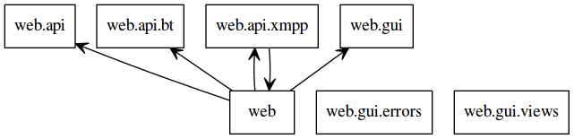

.. _web:

Web
===

Die Web Komponente soll nun, nachdem die Basisfunktionalität seitens der Datenübertragung implementiert ist, eine Schnittstelle für Nutzer und Frontends zur Steuerung bieten.

Um das Programm auch auf entfernten Rechnern steuern zu können, wurde hier die Variante einer JSON-RPC API gewählt.
Außerdem wurde ein minimales Web Frontend implementiert um bereits erhaltene Torrentlisten und eigene Torrents darzustellen.
Dafür wurde das Web Framework Flask bzw. das Flask Plugin Flask-JSONRPC genutzt.

Eine minimale Flask Anwendung ist dabei sehr einfach strukturiert.
Erst wird ein Flask-Objekt erzeugt, welches dann Methoden zur Verfügung stellt, die wiederum als Decorator für Funktionen genutzt werden.

.. code-block:: python
   :caption: Flask Beispiel :cite:`flask:online`

    from flask import Flask
    app = Flask(__name__)

    @app.route("/")
    def hello():
        return "Hello World!"

    if __name__ == "__main__":
        app.run()

In diesem Beispiel wird ein Objekt "app" der Klasse Flask erzeugt. Daraufhin wird die Funktion hello() mit @app.route("/") dekoriert, was zur Folge hat, dass wenn die Anwendung mit app.run() lokal gestartet wird, beim Aufruf von "http://localhost:5000/" in einem Browser der String "Hello World!" ausgegeben wird. 5000 ist hier der Standardport von Flask und kann bei Bedarf angepasst werden.

Aufbau der Komponente
---------------------

.. figure:: resources/classes_web.png
   :align: center
   :alt: Klassendiagramm Web
   :width: 20%

   Klassendiagramm Web

Da auch dieser Teil parallel zum XmppClient und dem BitTorrentClient laufen muss, soll das app-Objekt in einem neuen Thread gestartet werden.

.. _web_init:
.. code-block:: python
   :caption: Web initalization

   app = Flask(__name__)

   [...]

   class Web(Thread):
       def __init__(self, api_host='localhost', api_port=8080):
           super(Web, self).__init__()
           self.api_port = api_port
           self.api_host = api_host

       def run(self):
           app.run(host=self.api_host, port=self.api_port)

Dazu wird, wie in :ref:`web_init` zu sehen, auf Modulebene das app-Objekt erstellt und in einer Klasse genutzt, die später wiederum zusammen mit den anderen Komponenten im XMPP Client als Thread gestartet werden kann.

   Packages Web

Das Modul ist unterteilt in die Submodule api und gui.

Im Modul api sind die Funktionen der JSON-RPC API definiert. Dieses ist wiederum unterteilt in "bt" und "xmpp", um die dort definierten Routen entsprechend ihrem Zweck aufzuteilen.

Das gui Modul beinhaltet Routen und Ressourcen des Web Frontends. Dieses bietet aber nur Funktionen um eigene Torrents und gesammelte Shares anzuzeigen. Es ist als Übersicht gedacht und stellt keineswegs eine komplette Schnittstelle zu allen Funktionen dar.

Das api Modul
-------------

.. code-block:: python
   :caption: initalisieren des jsonrpc Objekts und Import der Funktionen (bitween/components/web/__init__.py)

   [...]
   app = Flask(__name__)
   jsonrpc = JSONRPC(app, '/api', enable_web_browsable_api=enable_web_api)

   from .api import versions, safe_exit, get_all_torrents
   from .api.bt import [...]
   from .api.xmpp import [...]

Das api Modul basiert auf der Flask Erweiterung Flask-JSONRPC.
Diese wird mit dem app Objekt und einem Prefix für die gewünschten Routen initialisiert.

Die entsprechenden Funktionen werden dann aus dem Submodul importiert.

.. code-block:: python
   :caption: Definition einer JSON-RPC Funktion (bitween/components/web/api/__init__.py)

   from .. import jsonrpc

   [...]
   @jsonrpc.method('Api.versions')
   def versions():
       import libtorrent
       import sleekxmpp
       versions = {"libtorrent": '' + libtorrent.version,
                   "sleekxmpp": '' + sleekxmpp.__version__}
       logger.debug(versions)
       return versions
   [...]

Das Submodul importiert dann das jsonrpc Objekt. Hier ist wichtig zu beachten, dass diese Imports erst nach dem Erstellen des Objektes im übergeordneten Modul auszuführen sind.
Die Funktion selbst implementiert die Abfrage der verwendeten libtorrent und SleekXMPP Funktionen. Dazu wird ein Dictionary erstellt, das als JSON String zurückgegeben und von Flask versendet werden kann.

Aufgerufen werden die so implementierten Funktionen dann mit einem HTTP POST auf die Route "http://ip:port/api" mit einem JSON Payload in folgendem Format:

.. code-block:: JSON
   :caption: Format des JSON Payloads

    {
      "jsonrpc": "2.0",
      "method": "Api.versions",
      "params": {},
      "id": "1234"
    }

In diesem Beispiel wird die oben beschriebene Methode "Api.versions" ohne Parameter aufgerufen. Die ID ist eine zufällige Nummer, die der Antwort ebenfalls als "id" angehangen wird, um den Aufruf zuordnen zu können.

Auf diese Art wurden folgende Funktionen eingefügt:

========================= ===============   ==========================================================================
Aufruf                    Parameter         Funktion
========================= ===============   ==========================================================================
Api.versions              --                gibt die Verwendeten Versionsnummern zurück
Api.exit                  --                leitet das saubere Beenden der Anwendung ein
bt.get_torrents           --                listet die eigenen Torrents auf
bt.add_path               path              generiert einen neuen Torrent aus Datei oder Verzeichnis unter <path>
bt.add_torrent_by_hash    hash, save_path   legt einen neuen Torrent anhand von <hash> an, speichert nach <save_path>
bt.del_torrent            hash              löscht Torrent mit Hash <hash>
xmpp.get_hashes           --                liefert eine Liste mit aggregierten Hashes und gefundenen Endpunkten
xmpp.get_shares           --                liefert eine Liste aller Kontakte und deren Shares
========================= ===============   ==========================================================================

Das gui Modul
-------------

Mit dem gui Modul wurde ein Interface implementiert, über das der User eine Übersicht über die gefundenen und eigenen Torrents bekommen kann. Dies dient allerdings eher als Beispiel. Hier wurde keine komplette Nutzerschnittstelle geschrieben, sondern lediglich genug Funktionalität um schnell eine Übersicht bekommen zu können.

Diese Funktionen wurden gekapselt als Flask Blueprint und können somit für spätere Versionen leicht entfernt oder weiterentwickelt werden.
Hier soll deshalb nur ein kurzer Überblick über das bisherige Vorgehen gegeben werden.

.. code-block:: python
   :caption: Setup des gui Blueprints (bitween/components/web/gui/__init__.py)

   from flask import Blueprint

   gui = Blueprint('gui', __name__, template_folder='templates', static_folder='static')

   from . import views, errors

Es wird ein neues Blueprint Objekt gui erstellt. Dieses wird benötigt um im nächsten Schritt die Routen zu importieren, da diese wiederum mit der gui.route() Funktion dekoriert werden.

.. code-block:: python
   :caption: Index Funktion des gui Blueprints (bitween/components/web/gui/views.py)

   @gui.route('/', methods=['GET'])
   def index():
       [...]
       return render_template('gui_index.html', torrents=handles.get_shares())

Diese Beispielroute für die Index Route "/" wird nur für die GET Methode definiert. Es wird eine neue Liste der eigenen Torrents erstellt und als "torrents" zusammen mit dem Template "gui_index.html" (im Unterordner "templates") an die Funktion render_template() übergeben, die daraufhin einen String mit dem HTML Code generiert, der wiederum zurückgegeben und von Flask ausgeliefert wird.

.. code-block:: python
   :caption: Registrieren des Blueprints am app Objekt

   from .gui import gui as gui_blueprint

   [...]

   app.register_blueprint(gui_blueprint)

Registriert wird der Blueprint dann am app Objekt über die Funktion register_blueprint() mit dem importierten Blueprint als Parameter.
