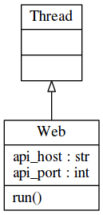

Web
===

Die Web Komponente soll nun, nachdem die Basisfunktionalität seitens der Datenübertragung implementiert ist, eine Schnittstelle für Nutzer und Frontends zur Steuerung bieten.

Um das Programm auch auf entfernten Rechnern steuern zu können, wurde hier die Variante einer JsonRPC API gewählt.
Außerdem wurde ein minimales Web Frontend Implementiert um bereits erhaltene Torrentlisten und eigene Torrents darzustellen.
Dafür wurde das Web Framework Flask, bzw. das Flask Plugin Flask-JSONRPC genutzt.

Aufbau der Komponente
---------------------

.. figure:: resources/packages_web.png
   :align: center
   :alt: Packages Web

   Packages Web

   Klassendiagramm Web

.. code-block:: none

    web/
        api/
            __init__.py
            bt.py
            xmpp.py
        gui/
            templates/
            __init__.py
            errors.py
            views.py
        static/
        __init__.py

.. todo::

    was zu jsonrpc suchen