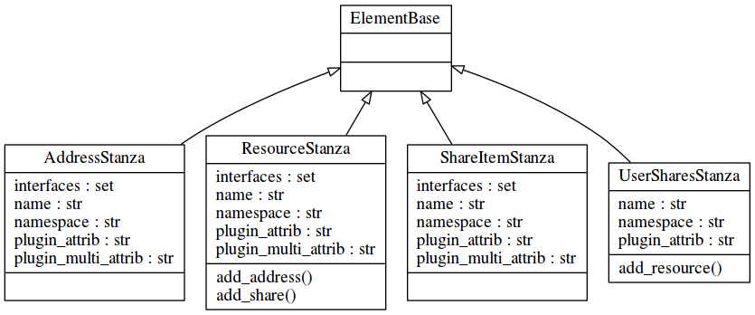
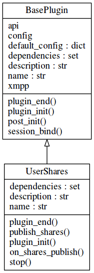
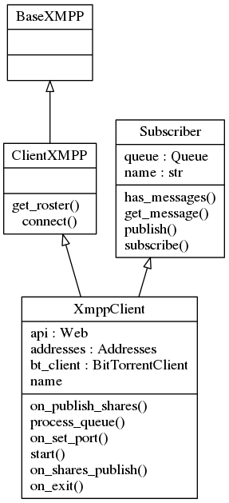

.. _xmpp:

XMPP
====

Im vorigen Kapitel :ref:`bittorrent` wurde die Implementierung eines BitTorrent Clients beschrieben, der eine Liste der zu verteilenden Torrents generiert, und der andererseits die IP Adressen und Ports der zu downloadenden Torrents benötigt.

Die XMPP Komponente muss nun also diese Liste inklusive der eigenen IP Adressen an alle Kontakte verteilen und außerdem eine Liste der empfangenen Torrents und der entsprechenden Quellen führen.

Das hier verwendete Python Modul SleekXMPP bietet hier die Möglichkeit diese Funktionen in einem Plugin zu implementieren, das in einem ansonsten übersichtlichem XMPP Client geladen werden kann.

Die folgenden Kapitel beschreiben die Stanzas, in denen die benötigten Informationen übertragen werden sollen, sowie den Aufbau des Plugins.
Danach wird das Einbinden in den XMPP Client erläutert.

Benötigte Stanzas
-----------------

Die benötigten Informationen umfassen mehrere gekapselte Elemente.

Es wird davon ausgegangen, dass ein XMPP Account an mehreren Ressourcen zur gleichen Zeit online ist. Diese wiederum haben sehr wahrscheinlich unterschiedliche IP Adressen und Ports, und bieten verschiedene Torrents an.

Daraus ergibt sich folgende Struktur der Daten (hier als Beispiel in Pseudo-XML):

.. code-block:: xml

   <Ressourcen>
      <1. Ressource>

         <Addressen>
            <addresse ip='1.1.1.1' port=11>
            <addresse ip='2.2.2.2' port=22>
         </Addressen>

         <Shares>
            <share hash='123123123' name='beispiel1' size=123>
            <share hash='234234234' name='beispiel2' size=234>
         </Shares>

      </1. Ressource>
      ...
      <n. Ressource>

         <Addressen> ... </Addressen>
         <Shares> ... </Shares>

      </n. Ressource>
   </Ressourcen>

Diese logische Verschachtelung wurde in den folgenden Stanzas abgebildet.

   Klassendiagramm der benötigten Stanzas

Jede Stanzaklasse wurde von ElementBase abgeleitet, der Basisklasse für Stanzas aus SleekXMPP. Mithilfe dieser können die XML Elemente einfach als Klassen und Attribute von Klassen behandelt werden, ohne das XML als String behandelt werden muss.

Das "äußerste" Stanza ist das UserShareStanza. Diesem Container Stanza können über die Methode add_resource() Ressourcen, also angemeldete XMPP Clients als Endpunkte, hinzugefügt werden. In diesem ResourceStanza können nun per add_address() und add_share() AddressStanzas und ShareItems eingebettet werden.

Die Verknüpfung der jeweiligen Stanzas erfolgt dabei aus dem jeweils übergeordnetem Stanza.

.. code-block:: python

   class UserSharesStanza(ElementBase):
       name = 'user_shares'
       namespace = 'https://xmpp.kwoh.de/protocol/shares'
       plugin_attrib = 'user_shares'

       def add_resource(self, resource=''):
           [...]
           resource_stanza = ResourceStanza(None, self)
           resource_stanza['resource'] = resource
           return resource_stanza

Hier wird in der Methode add_resource() ein neues ResourceStanza erzeugt.
"ResourceStanza(None, self)" verknüpft das neu erstellte Stanza mit "self", dem UserSharesStanza.

Der Namespace ist hier Erkennungsmerkmal aller zum Plugin gehörigen Stanzas und wird genutzt um eingehende Stanzas dem Plugin zuzuordnen.

Diese Stanzastruktur wird vom im folgenden Kapitel beschriebenen Plugin benutzt.

Aufbau des Plugins
------------------

Im SleekXMPP Plugin wird nun die beschriebene Datenstruktur benutzt, um die zu verteilenden Daten zu senden bzw. auszulesen.

Jedes SleekXMPP Plugin wird implementiert, indem eine neue Klasse aus der SleekXMPP Klasse BasePlugin abgeleitet wird und in dieser die benötigten Methoden überschrieben werden.

   Klassendiagramm XMPP Erweiterung

Hier wird eine neue Klasse UserShares erstellt und die Methoden plugin_init() und plugin_end() überschrieben. Diese werden später vom Client beim Starten bzw. Beenden des Plugins ausgeführt.

Außerdem wurden hier die Methoden publish_shares() und stop() implementiert.

publish_shares() wird aufgerufen sobald der Client startet, außerdem wenn Änderungen an den Torrents oder des BitTorrent Clients stattfinden, beispielsweise falls ein neuer Torrent hinzugefügt wird oder sich der NAT Port ändert.

on_shares_publish() hingegen stellt das Gegenstück zu publish_shares() dar: diese Methode soll das Empfangen der Daten abwickeln.

Hier soll ein Plugin implementiert werden, das auf dem bereits in Kapitel :ref:`grundlagen` beschriebenen Personal Eventing Protocol (PEP) aufsetzt.

Aufgrund der Funktionalität vom PEP müssen Informationen nur gesendet werden, wenn sich etwas an den zu verteilenden Daten ändert. Der XMPP Server wird selbst dafür sorgen, das Clients, die zur Laufzeit erst online gehen, die aktuellen Daten bekommen und im Falle von Aktualisierungen alle betreffenden Clients ein Update erhalten.

Dabei muss beachtet werden, das eine Limitierung vom PEP umgangen werden muss: es werden keine multiplen Ressourcen pro Account unterstützt. Da allerdings bei der Anmeldung eine Liste der bisherigen veröffentlichten Daten vom Server gesendet wird, auch an den eigenen Account, kann diese Liste einfach um die neue Ressource erweitert werden.

Start des Plugins
-----------------

.. code-block:: python

   def plugin_init(self):
      register_stanza_plugin(
               UserSharesStanza, ResourceStanza, iterable=True)
      register_stanza_plugin(
               ResourceStanza, ShareItemStanza, iterable=True)
      register_stanza_plugin(
               ResourceStanza, AddressStanza, iterable=True)

      self.xmpp['xep_0163'].register_pep('shares', UserSharesStanza)
      self.xmpp.add_event_handler('shares_publish', self.on_shares_publish)

Wird das Plugin vom Client geladen, wird zuerst die plugin_init() Methode aufgerufen.
In dieser werden die vom Plugin genutzten Stanzas registriert und das UserShares Stanza unter dem Namen "shares" im PEP Plugin registriert.
Das PEP Plugin wird daraufhin den Namespace des UserShares Stanzas als unterstütztes Feature der Service Discovery hinzufügen. Auf diese Art werden nur solche Clients die Informationen erhalten, die das Plugin unterstützen. Außerdem werden in register_pep() die Events "shares_publish" und "shares_retract" angelegt.

Als nächstes wird ein Event Handler für shares_publish registriert. In der damit verknüpften Methode on_shares_publish() soll das Empfangen und Einpflegen der Daten erfolgen.

Empfangen von Daten
-------------------

Wird nun ein UserShare Stanza empfangen, wird über den Namespace identifiziert, dass das UserShare Plugin dafür zuständig ist, und die zugehörige Methode on_shares_publish() wird mit dem Stanza als erstem Argument aufgerufen.

Diese Informationen werden in einem Objekt der Klasse ContactShares der Models gehalten.
Diese dient als Wrapper um ein Python Dictionary und bietet einige von der Datenstruktur abstrahierte Funktionen wie get_resource(jid, resource), die für einen bestimmten User die Daten einer bestimmten Ressource liefert.
Außerdem wurden mit threading.Lock Sperren gegen den Zugriff aus mehreren Threads zur gleichen Zeit implementiert.

.. code-block:: python

    @staticmethod
    def on_shares_publish(msg):
        """ handle incoming files """
        incoming_shares = msg['pubsub_event']['items']['item']['user_shares']
        logger.info('%s' % incoming_shares)

        contact_shares.clear(msg['from'])

        for resource in incoming_shares['resources']:
            [...]

            for item in resource['share_items']:
                logger.info('adding share %s to resource %s' % (item['name'], resource['resource']))
                contact_shares.add_share( msg['from'],
                                          resource['resource'],
                                          item['hash'],
                                          item['name'],
                                          item['size'])

            for address in resource['ip_addresses']:
                contact_shares.add_address( msg['from'],
                                            resource['resource'],
                                            address['address'],
                                            address['port'])

        publish('recheck_handles')

In der on_shares_publish() Methode werden dann zuerst alle bislang vorhandenen Daten gelöscht, da davon ausgegangen wird, dass in dem erhaltenen Paket alle aktuellen Daten vorhanden sind. Daraufhin wird über die gesendete Liste an Ressourcen iteriert. Jede Ressource sollte "share_items", also Informationen über Torrents, und mindestens eine IP-Adresse mit Port haben.

Wurde das Datenpaket verarbeitet, wird eine Nachricht ohne Argumente auf Topic "recheck_handles" geschickt. Das wiederum hat zur Folge, dass im BitTorrent Client über alle eigenen Torrents iteriert und überprüft wird, ob neue Quellen für einen der eigenen Torrents vorliegen.

Auf diese Art können zur Laufzeit neue Quellen zu vorhandenen Torrents hinzugefügt werden.
Außerdem liegt eine durchsuchbare Datenstruktur vor, die beispielsweise von Frontends benutzt werden kann um die empfangenen Torrentlisten anzuzeigen.

Versenden der Daten
-------------------

Das Versenden der Daten wird in der Methode publish_shares() abgewickelt.
Diese soll, wenn aufgerufen, eine aktuelle Liste der Torrents, verpackt in die definierten Stanzas versenden.

Hier muss darauf geachtet werden, dass nicht nur eine Liste der aktuellen Torrents gesendet wird. Es müssen außerdem die bereits empfangenen Torrents anderer Ressourcen des eigenen Accounts mit einbezogen werden.

Dazu wird die Tatsache genutzt, dass nach dem Senden auch immer eine Liste der eigenen Torrents empfangen wird. Das hat zur Folge, dass in derselben Datenstruktur, in der auch die Torrent Daten anderer Nutzer gespeichert werden, die eigenen Daten vorliegen.

Es muss also nurnoch der eigene Useraccount aus der Liste ausgelesen und die Daten der lokalen Ressource aktualisiert werden.

Danach wird die bereits erläuterte Struktur aus Stanzas entsprechend der Daten erstellt und gesendet.

Aufbau des Clients
------------------

.. _classes_xmpp:

   Klassendiagramm XMPP

Das beschriebene Plugin soll nun von einem XMPP Client genutzt werden. Hierfür wird eine neue Klasse XmppClient aus der SleekXMPP Klasse ClientXMPP und der bereits im BitTorrent Client genutzten Klasse Subscriber abgeleitet. (Abb. :ref:`classes_xmpp`)

ClientXMPP bringt hierbei schon alle zum Verbinden benötigten Voraussetzungen mit. Initalisiert wird das Objekt im XmppClient Konstruktor mit der JID und dem benötigten Passwort.

.. code-block:: python

        self.register_plugin('xep_0030')  # service discovery
        self.register_plugin('xep_0115')  # entity caps
        self.register_plugin('xep_0163')  # pep
        self.register_plugin('shares', module=share_plugin)

Danach werden die benötigten Erweiterungen registriert, die bereits Teil von SleekXMPP sind: Service Discovery, Entity Caps und PEP.
Auch das UserShares Modul wird, wie die anderen Plugins, über register_plugin() registriert. Hier wird allerdings noch auf das vorher importierte Modul verwiesen, da dieses nicht Teil von SleekXMPP ist.

Außerdem wird im Konstruktor das "session_start" Event mit einer Methode start() der Klasse verknüpft. Hier wird nach dem Verbinden die eigene Präsenz gesendet und der Roster, also die Kontaktliste, empfangen.

In dieser Grundkonfiguration wäre der Client grundsätzlich schon betriebsbereit.
Allerdings fehlt noch jegliche Art der Interaktion mit anderen Komponenten der Anwendung.

Daher wird im Konstruktor noch ein Scheduler hinzugefügt, der zyklisch die vom Subscriber geerbte Message Queue verarbeitet. Dies erfolgt auf dieselbe Art wie schon im BitTorrent Client: alle mit "on_" beginnenden Methoden werden automatisch als Topic abonniert und werden in der verknüpften Methode aufgerufen, wenn die entsprechenden Nachrichten vorliegen.

Außerdem werden im Konstruktor die anderen Komponenten der Anwendung gestartet: der BitTorrent Client und eine im Kapitel :ref:`web` näher beschriebene JSON-RPC API mit einem Web Frontend zur Übersicht über die Torrents.

Da die eigene IP Adresse Teil der zu versendenden Datenpakete ist, wird hier außerdem ein Prozess angestoßen, der die eigene IPv4 Adresse herausfinden soll. Da diese hinter einem DSL Router im lokalen Netz nicht bekannt ist, wurde hier das Modul ipgetter genutzt. In diesem sind eine Reihe an Servern hinterlegt, die die IP zurück geben, von der die Anfrage kommt.

Die IPv6 Adresse kann jedoch aus dem System ausgelesen werden. Hierfür kommt das Modul netifaces zum Einsatz, das betriebssystemunabhängig die momentanen IP Adressen auslesen kann.

Der so konstruierte Client ist somit der Hauptteil der Anwendung. Aus ihm heraus werden die anderen Teile der Anwendung kontrolliert gestartet. Dadurch, dass wesentliche Funktionalität in das Plugin ausgelagert wurde, ist er übersichtlich, aber um neue Funktionen erweiterbar ohne die Funktion des Plugins zu beeinflussen.

Im folgenden Kapitel wird die Web Komponente beschrieben, die einerseits eine minimale Weboberfläche zur Übersicht darstellt, aber auch eine JSON-RPC API zur Verfügung stellt, über die eventuelle Frontends mit der Anwendung kommunizieren können.
